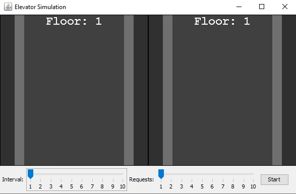
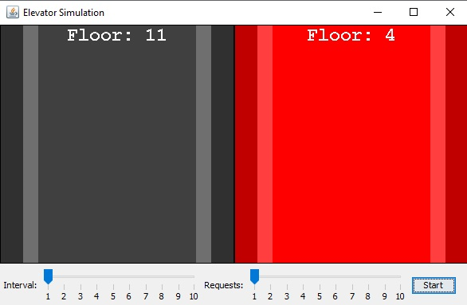

# Имплементация GUI-приложения, реализующего алгоритм симуляции движения двух лифтов в многоэтажном доме
Все поля, методы и классы задокументорованы по стандарты Javadoc.

## Контент

0. [Основное](#Основное)
1. [Примеры кода](#Примеры-кода)
2. [Изображения](#Изображения)

## Основное
### Видео работы программы:
____
- Call, Elevator, ElevatorControlSystem, ElevatorSimulationGUI классы, поддерживающие операции:
    - Выбор интервала между заявками
    - Выбор количества заявок
    - Симуляция движения лифтов и остановки на этажах по алгоритму LOOK(SCAN-LOOK)

Программа работает следующим образом:
Случайным образом генерируются заявки(можно настроить количество и интервал появления заявки), для каждый из которых известно:
этаж, на котором она была произведена, направление движения(вверх или вниз) и целевой этаж, на который нужно попасть.
Обслуживание заявок реализуется по алгоритму "планирования запросов к жесткому диску" LOOK, который также известен под названием "Алгоритм лифта".
Каждый лифт идет либо вверх, либо вниз, не меняя направления и побирая все заявки, находящиеся на пути. Выбор лифта, который должен будет прийти к заявке реализуется через метод assignElevator класса ElevatorControlSystem.
Соответственно, идя вверх, лифт подбирает и высажиевает всех пассажиров, чьи заявки были выше или целевой этаж сверху. Аналогично, когда он после этого идет вниз.
Оба лифта работают в своём потоке, не мешая друг другу. В GUI имплементации остановка лифта имитируется красным цветом, что означает, что лифт либо подобрал человека, либо высадил его на целевом этаже.
Само GUI приложение также имеет пару потоков, которые представляют собой две различных панели лифта.
____
[:arrow_up:Headline](#Headline)

## Примеры кода
Конструктор с параметрами класса(этаж, направления, этаж назначения) `Call`:
```Java
public Call(int floor, Direction direction, int destination) {
        this.floor = floor;
        this.direction = direction;
        this.destination = destination;
    }
```
____
Конструктор с параметрами класса(идентификатор, текущий этаж, направление, запущен, массивы этажей) `Elevator`:
```Java
public class Elevator {
  public Elevator(int id, int currentFloor, int maxFloor, int minFloor) {
    this.id = id;
    this.currentFloor = currentFloor;
    this.maxFloor = maxFloor;
    this.minFloor = minFloor;
    this.destinationsUp = new ArrayList<>();
    this.floorToDest = new ArrayList<>();
    this.destinationsDown = new ArrayList<>();
    this.direction = Direction.STOP;
    this.isRunning = true;
  }
}
```
____

Методы добавления всех целевых этажей класса `Elevator`:
```Java
public class Elevator {

    public void addDestination(int destination) {
        if (currentFloor > destination) {
            destinationsDown.add(destination);
            destinationsDown = destinationsDown.stream().distinct().collect(Collectors.toList());
        } else {
            destinationsUp.add(destination);
            destinationsUp = destinationsUp.stream().distinct().collect(Collectors.toList());
        }
        destinationsUp.sort(null);
        destinationsDown.sort((a, b) -> b - a);
    }
    public void addDestinationDown(int destination) {
        destinationsDown.add(destination);
        destinationsDown = destinationsDown.stream().distinct().collect(Collectors.toList());
        destinationsDown.sort((a, b) -> b - a);
    }
    public void addDestinationUp(int destination) {
        destinationsUp.add(destination);
        destinationsUp = destinationsUp.stream().distinct().collect(Collectors.toList());
        destinationsUp.sort(null);
    }
}
```
____
Метод назначения этажа лифту класса `ElevatorControlSystem`:
```Java
public class ElevatorControlSystem {

    private static synchronized  void assignElevator(Call call) {
        Elevator closestElevator = null;
        int closestDistance = Integer.MAX_VALUE;
        for (Elevator elevator : elevators) {
            if (elevator.getDirection() == Direction.STOP) {
                if (closestDistance > elevator.distanceFrom(call.getFloor())) {
                    closestElevator = elevator;
                    closestDistance = elevator.distanceFrom(call.getFloor());
                }
            } else if (elevator.getDirection() == Direction.UP) {
                if (call.getFloor() >= elevator.getCurrentFloor() && call.getDirection() == Direction.UP) {
                    if (closestDistance > elevator.distanceFrom(call.getFloor())) {
                        closestElevator = elevator;
                        closestDistance = elevator.distanceFrom(call.getFloor());
                    }
                } else {
                    if (closestDistance > elevator.distanceDestFromUP(call.getFloor())) {
                        closestElevator = elevator;
                        closestDistance = elevator.distanceFrom(call.getFloor());
                    }
                }
            } else if (elevator.getDirection() == Direction.DOWN) {
                if (call.getFloor() <= elevator.getCurrentFloor() && call.getDirection() == Direction.DOWN) {
                    if (closestDistance > elevator.distanceFrom(call.getFloor())) {
                        closestElevator = elevator;
                        closestDistance = elevator.distanceFrom(call.getFloor());
                    }
                } else {
                    if (closestDistance > elevator.distanceDestFromDown(call.getFloor())) {
                        closestElevator = elevator;
                        closestDistance = elevator.distanceFrom(call.getFloor());
                    }
                }
            }

            if (closestElevator != null) {
                closestElevator.addDestination(call.getFloor());
                if (closestElevator.getDirection() == Direction.STOP) {
                    if (call.getFloor() >= closestElevator.getCurrentFloor()) {
                        closestElevator.setDirection(Direction.UP);
                    } else {
                        closestElevator.setDirection(Direction.DOWN);
                    }
                }
                closestElevator.addToMap(call.getFloor(), call.getDestination());
            }
        }
    }
}
```
____
Реализация задержки и обновления лифта класса `ElevatorSimulationGUI`:
```Java
public class ElevatorSimulationGUI {

    Timer timer = new Timer();
      timer.schedule(new TimerTask() {
          private int count = 0;
          private final Random random = new Random();

          @Override
          public void run() {
              int flr = random.nextInt(15) + 1;
              int dst;
              Direction dr;

              do {
                  dst = random.nextInt(15) + 1;
              } while (dst == flr);

              if (flr > dst) {
                  dr = Direction.DOWN;
              } else {
                  dr = Direction.UP;
              }
              try {
                  ElevatorControlSystem.addCall(new Call(flr, dr, dst));
              }
              catch (Exception ignored)
              {}
              count++;
              if (count >= numRequests) {
                  // Остановить таймер после добавления всех вызовов
                  timer.cancel();
              }
          }
      }, 0, interval);
      @Override
      public void run() {
          while (isRun) {
              try {
                  Thread.sleep(1000); // ждем 1 секунду перед перемещением на следующий этаж
              } catch (InterruptedException e) {
                  JOptionPane.showMessageDialog(elevatorPanel, e.getMessage(), "Error", JOptionPane.ERROR_MESSAGE);
              }
              elevatorPanel1.setFloor(lift1.getCurrentFloor());
              elevatorPanel2.setFloor(lift2.getCurrentFloor());
              elevatorPanel1.open = lift1.getOpenStatus();
              elevatorPanel2.open = lift2.getOpenStatus();
          }
      }
}
```
____
## Изображения
Here's what it looks like
----
Основное окно

----
Запущенная симуляция

----
----
